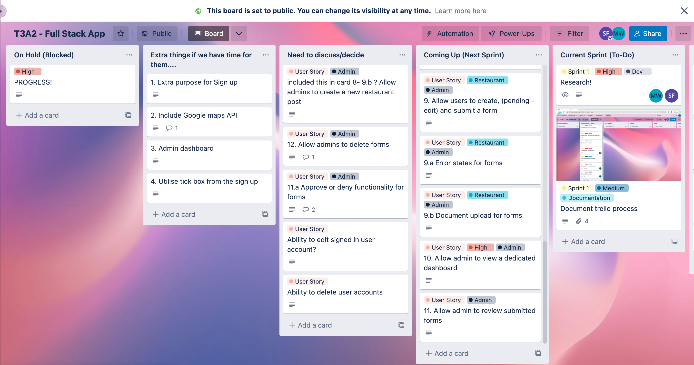
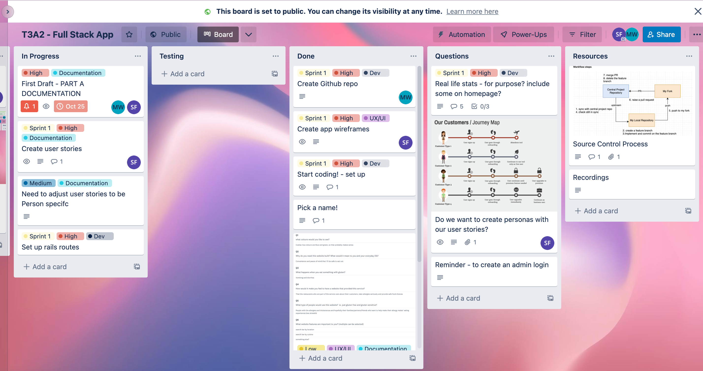

# Gluten Free Finder application
## Megan Van Der Weide & Sofia-Bella Frugone

--- 
📣 Deployed App: 

🔔 Deployed Backend: https://gluten-free-finder-api.herokuapp.com/

🖥 Frontend Repo: https://github.com/sofia-frugone/Gluten-Free-Finder-React

🖥 Backend Repo: https://github.com/MeganJade5/Gluten-Free-Finder-API

📖 Part A Documentation Repo: https://github.com/MeganJade5/Gluten-Free-Finder-Docs

Gluten Free Finder is a website for the general public to locate a credible gluten-free restaurant. It removes the trial and error and suffering from eating something with Gluten. This web application is a service connecting restaurants and customers. It showcases and advertises that the restaurants care about their customers, take allergies seriously and provide safe food choices.  The application has been built with the Rails and React stack and deployed with Netlify and Heroku.

---
### Installation Instructions
To use the production app, please visit **deployed app** and create an account. To use the app locally, please follow the below instructions.

**Requirements:**
- Ruby 3.1.0
- Rails 7.0.4
- Postgresql

**Gluten-Free-Finder-API**

Installing Ruby:

- Ensure Ruby is installed by entering the following command in Terminal: ruby —version
- If a valid Ruby version is not returned, refer to the following link to install Ruby for your operating system: https://www.ruby-lang.org/en/downloads/

Installing PostgreSQL:

- Ensure PostgreSQL is installed by entering the following command in Terminal: psql —version
- If a valid version of PostgreSQL is not returned, refer to the link below to install PostgreSQL for your operating system: https://www.postgresql.org/download/
Downloading the Application: Navigate to the GitHub repository as linked above; and Either clone or download ZIP of the application.

Installing Gems:

- Ensure you have Bundler installed by opening Terminal and entering the following command: bundler —version
- If Bundler is not installed and an error is returned, enter the following command to install: gem install bundler Navigate to the root directory of the application and install the required gems with: bundle install
  
Running the Application on your localhost:

Clone the app: 
- Create a directory on your machine named `Gluten-Free-Finder` and `$ cd` into it.
- Whilst in the directory, clone the repo `git clone https://github.com/MeganJade5/Gluten-Free-Finder-API.git`
- `$ cd` into the folder `Gluten-Free-Finder-API`
- install packages above
- Ensure postgresql is running
- Create local database `rails db:create`
- Seed the local database `rails db:seed` to view dummy data in local application
- Ensure you are in the application's root directory and enter the following command to run the application within your browser: `rails s`
- The server will run on local host port 3000 in your browser `http://localhost:3000 `

**Gluten-Free-Finder-FrontEnd**

**Requirements:**
- React ^18.2.0
- Node ^16.15.0
- npm ^8.5.5

Installing React: 
- Ensure React is installed by entering the following command in Terminal: npm —version
- If a valid React version is not returned, refer to the following link to install React for your operating system https://reactjs.org/

Installing package.json:

- Ensure you have installed npm

  
Clone the app: 
- Create a directory on your machine named `Gluten-Free-Finder` and `$ cd` into it.
- Whilst in the directory, clone the repo `https://github.com/sofia-frugone/Gluten-Free-Finder-React.git`
- `$ cd` into the folder `Gluten-Free-Finder-React`
- install packages above
- in the project directory run `npm start`
- use `npm test` to view the interactive watch mode
- The server will run on local host port 3000 in your browser `http://localhost:3000 `
  
**NOTE**
To view as admin:

The seed data file created an admin account for you with the following credentials to login: 

email: admin@glutenfreefinder.com

password: admin123

---

## API Endpoints
**Authentication for user**
- POST /auth/signup
- POST /auth/signin
- GET /auth/signout
 
**Authentication for admin**
- GET /admin
- GET /admin/posts
- GET /admin/show_post
 
**Posts**
- To view posts: GET /posts
- To view individual post: GET /posts/: id 
- To create a post: POST /posts
- To delete a post: DELETE /posts/: id
- To update a post: PATCH /posts/: id

---

## Testing
The application has been tested in Chrome Version 107.0.5304.110 (Official Build) (arm64) and Firefox Version 15.1 (17612.2.9.1.20) on Mac OS Monterey 12.0.1, M1. 

Manual Testing Logs - [found here!](https://docs.google.com/spreadsheets/d/1c2GitubExcjdO2MHKTi4ZNrZ8e27vQepE55oi4mlJDE/edit#gid=0)

These Testing Logs include the following pages:  
1. [User Test Logs](https://docs.google.com/spreadsheets/d/1c2GitubExcjdO2MHKTi4ZNrZ8e27vQepE55oi4mlJDE/edit#gid=0)
2. [Admin Test Logs](https://docs.google.com/spreadsheets/d/1c2GitubExcjdO2MHKTi4ZNrZ8e27vQepE55oi4mlJDE/edit#gid=2130751966)
3. [Backend Test Logs](https://docs.google.com/spreadsheets/d/1c2GitubExcjdO2MHKTi4ZNrZ8e27vQepE55oi4mlJDE/edit#gid=473735298)
4. [Frontend Test Logs](https://docs.google.com/spreadsheets/d/1c2GitubExcjdO2MHKTi4ZNrZ8e27vQepE55oi4mlJDE/edit#gid=1587885359)

The API Backend tested using the following:
- Rspec (please see rspec files) with 45 examples, 0 failures
- CLIENT HTTP (please see client.http file), 13 examples, 0 failures
  
Screen Recordings of Evidence of Testing:
Live Production Loom
---

## Libraries & Dependencies:

### Stack
**Front-end:** HTML, CSS, JavaScript, React, JSX, Material UI

**Back-end:** Rails, Ruby

**Database:** Postgresql

**Deployment:** Heroku & Netlify

**Testing:** Rspec-rails, Client HTTP (and dependencies below)

**Design:** Figma, Canva, Draw.io

**DevOps:** Git, Github, VS code

### Backend

- **Ruby 3.1.0:** programming language that is high-level and general purpose developed for productivity and simplicity. It is object driven. Used to build the backend API. It was particular helpful in creating models of the cuisine and food preparation categories which belong to the post model. 
  
- **Rails 7.0.4:** server side web application framework used to develop the backend api for models, controller, database structures.

- **Pg 1.1:** postgresql used as the database for Active Record. It manages the relational database. It’s reliable, scalable, free, open source and allows for data integrity and extensibility which has it’s own security features for data protection. 

- **puma 5.0:** management software that provides a powerful and secure storage system. It is the default server for Rails. 

- **Bycrypt 3.1.7:** hash algorith used for hashing passwords. This ruby gem provides a simple wrapper for safely handling passwords. 

- **Tzinfo-data:** timezone package to accompany Ruby. Used to provide timestamps on the post creation. 

- **Bootsnap:** Ruby plug in which provides a method to optimize and cache. It supports our YAML files. It reduces our booting times on the app by caching expensive computations. 

- **Activestorage:** facilitates uploading files to the cloud storage (Amazon s3 in below gem). It is the hosting service for Ruby. It also provides a disk service for testing or local deployments. 

- **Aws-sdk-s3:** web-based cloud storage service designed for online backup and archiving of data and applications on Amazon Web Services. used for file uploading images on the site when users add a new post.

- **Rack-cors:** supports the cross-origin resource sharing. Allows for web requests between domain and compatible front end app to request information from your Rails back end.. Together they make up Middleware that makes CORS-compatible Rack-framework applications. The gem will ensure the app is avoiding issues when the API is called from the frontend app. When a user clicking around on a front end app, those clicks send fetch requests to your Rails back end to perform tasks and collect data. Rack CORS allows this request to happen and gives you control over who can make requests and what kind of requests can be made.

- **Jwt:** Used for the API security to authenticate a user. The client application sends a JSON Web Token (JWT) in the authorization header of the HTTP request to the backend API. The tokens are open, standard way to represent the user's identity securely during a two-party interaction. JWT securely transmits information between parties and allows for claims or information to be transmitted in a compact and self-contained way.

- **Client HTTP Vs Code Extension:** Allows to send HTTP requests and view the response within vscode. Used to tests routing of pages, creating posts with and without tokens, and login scenarioes. 
 
### Testing in Development:

- **Debug:** debugging functionality for ruby. 

- **Rspec-rails:** Domain Specific Language testing tool used to test Ruby code. It is behavior driven that is used as a framework for unit testing

- **Factory_bot_rails:** for testing Ruby on Rails. Accompanies Rspec in that default values can be set in FactoryBot for creating, building, and pre-filling attributes for testing. 
Database_cleaner: cleans up the states in the postgresql database during tests. Easy way to turn what Rails calls “transactional_fixtures” in non-rails ActiveRecord projects.

- **Rails-controller-testing:** assigns controller tests and assert_template to the controller and integration tests 

- **Shoulda-matchers:** assists the Rspec gem. Provides one-liners to test common functionality to save lots of coding time. Tests the associations and validations (particularly used in the post testing). 

- **Faker:** Generates fake data. Used in the seed file to create posts in the database with pre-filled dummy data. 
 
 ### Frontend

- **react ^16.13.1:** A Javascript Front-end library. Used to build the user interfaces and UI components in this application. Accompanied by the react library. 
complimentary react libraries.

- **react-dom ^16.13.1:** A complimentary library to react that binds react to the DOM. This enables methods such as render() to render components in the browser.

- **react-router-dom ^5.2.0:** To build single-page application and conditional rendering of components. It is based on the route being used in the URL. Allowed for building a SPA that acts like a site with multiple pages.

- **react-scripts 3.4.1:** A script to run build tools required to transform React and JSX syntax into plain Javascript. Used to create a custom build script for the staging environment of the application.

- **axios ^0.19.2:** Axios is a Javascript library used to make HTTP requests to the backend API. Posts and auth each use axios to make HTTP requests to each dedicated api end points on the server side. 

- **Emotion/react & styled ^11.10.5:** Allows for writing CSS style with 
Javascript for object and string styles. It is powerful and predictable style composition to provide features such as labels and testing utilities. Allows for easy rendering, supports nested selectors, media queries and auto-prefixing. 

- **mui/material ^5.10.13:** Allows to build a design system based on Material Design. It is a comprehensive library of components that are lightweight CSS frameworks that are pre-built and ready to use. 

- **Web-vitals ^2.1.4:** Gem used to show how the pages perform based on real world usage data. It assists in seeing the ‘page experiences’ and overall UX. Provides a way of judging whether the elements are good or poor placements. and quantifies the measurement for page speed and user interactions. 

---

## Screenshots:
**Homepage**
**Restaurant Post**
**Sign up**
**Sign in**
**Create New Post**
**Admin Dashboard**
---

## Project Management

**Git Source Control**

Frontend: https://github.com/sofia-frugone/Gluten-Free-Finder-React/pulse
Backend: https://github.com/MeganJade5/Gluten-Free-Finder-API/pulse

**Project management tools:** Trello, Discord, Loom Videos

The project managment tool we've used to track our progress for this assesment is [Trello, which can be viewed here.](https://trello.com/b/g94algv7/t3a2-full-stack-app) We have 10 columns in our board, each of which contribute to an agile approach of product development.

1. **Blocked** Tasks which we are unable to continue with without further follow up. 
2. **Extras** Our nice-to-haves if time allows. 
3. **Need to discuss** Tasks which require more discussion.
4. **Coming Up** Tasks we will complete next sprint but need to look into before the sprint begins.
5. **To-do** Current sprint tasks.
6. **In progress** Tasks being worked on.
7. **Testing** Any tasks going through manual/user testing before being completed. 
8. **Done** Finished tasks!
9. **Questions** Similar to our discuss column however we added this board to help us visually.
10. **Resources** Any resources we want to keep during our development process. For quick reference.

 

 
 

--- 
## Reflection 